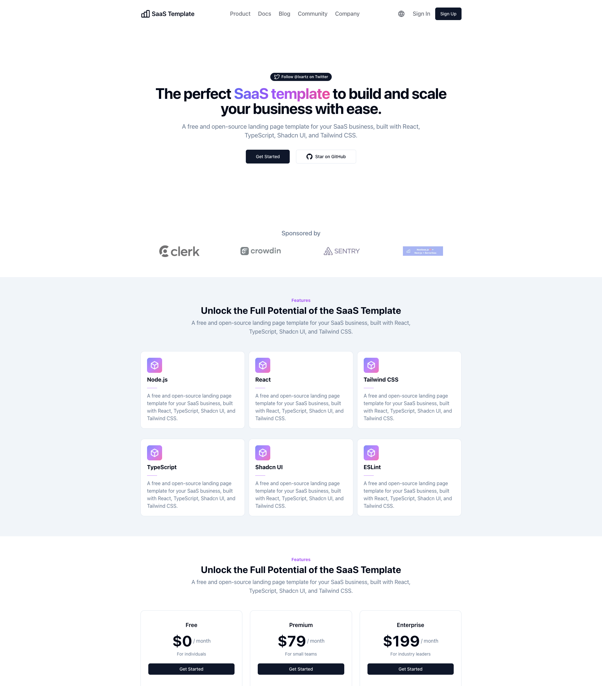
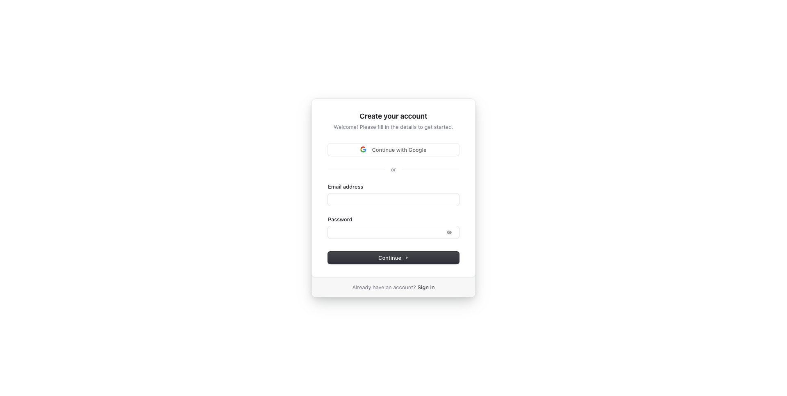

# Free and Open Source SaaS Boilerplate with Tailwind CSS and Shadcn UI

<p align="center">
  <a href="https://react-saas.com"></a>
</p>

🚀 **SaaS Boilerplate** is a powerful and fully customizable template to kickstart your SaaS applications. Built with **Next.js** and **Tailwind CSS**, and the modular UI components of **Shadcn UI**. This **Next.js SaaS Template** helps you to quickly build and launch SaaS with minimal effort.

Packed with essential features like built-in **Authentication**, **Multi-Tenancy** with Team support, **Role & Permission**, Database, I18n (internationalization), Landing Page, User Dashboard, Form handling, SEO optimization, Logging, Error reporting with [Sentry](https://sentry.io/for/nextjs/?utm_source=github&utm_medium=paid-community&utm_campaign=general-fy25q1-nextjs&utm_content=github-banner-nextjsboilerplate-logo), Testing, Deployment, Monitoring, and **User Impersonation**, this SaaS template provides everything you need to get started.

Designed with developers in mind, this **Next.js Starter Kit** uses TypeScript for type safety and integrates ESLint to maintain code quality, along with Prettier for consistent code formatting. The testing suite combines Vitest and React Testing Library for robust unit testing, while Playwright handles integration and E2E testing. Continuous integration and deployment are managed via GitHub Actions. For user management, authentication is handled by [Clerk](https://go.clerk.com/zGlzydF). For database operations, it uses Drizzle ORM for type-safe database management across popular databases like PostgreSQL, SQLite, and MySQL.

Whether you're building a new SaaS app or looking for a flexible, **production-ready SaaS template**, this boilerplate has you covered. This free, open-source starter kit has everything you need to accelerate your development and scale your product with ease.

Clone this project and use it to create your own SaaS. You can check the live demo at [SaaS Boilerplate](https://react-saas.com), which is a demo with a working authentication and multi-tenancy system.

## Sponsors

<table width="100%">
  <tr height="187px">
    <td align="center" width="33%">
      <a href="https://go.clerk.com/zGlzydF">
        <picture>
          <source media="(prefers-color-scheme: dark)" srcset="https://github.com/ixartz/SaaS-Boilerplate/assets/1328388/6fb61971-3bf1-4580-98a0-10bd3f1040a2">
          <source media="(prefers-color-scheme: light)" srcset="https://github.com/ixartz/SaaS-Boilerplate/assets/1328388/f80a8bb5-66da-4772-ad36-5fabc5b02c60">
          
        </picture>
      </a>
    </td>
    <td align="center" width="33%">
      <a href="https://l.crowdin.com/next-js">
        <picture>
          <source media="(prefers-color-scheme: dark)" srcset="public/assets/images/crowdin-white.png?raw=true">
          <source media="(prefers-color-scheme: light)" srcset="public/assets/images/crowdin-dark.png?raw=true">
          
        </picture>
      </a>
    </td>
    <td align="center" width="33%">
      <a href="https://sentry.io/for/nextjs/?utm_source=github&utm_medium=paid-community&utm_campaign=general-fy25q1-nextjs&utm_content=github-banner-nextjsboilerplate-logo">
        <picture>
          <source media="(prefers-color-scheme: dark)" srcset="public/assets/images/sentry-white.png?raw=true">
          <source media="(prefers-color-scheme: light)" srcset="public/assets/images/sentry-dark.png?raw=true">
          
        </picture>
      </a>
      <a href="https://about.codecov.io/codecov-free-trial/?utm_source=github&utm_medium=paid-community&utm_campaign=general-fy25q1-nextjs&utm_content=github-banner-nextjsboilerplate-logo">
        <picture>
          <source media="(prefers-color-scheme: dark)" srcset="public/assets/images/codecov-white.svg?raw=true">
          <source media="(prefers-color-scheme: light)" srcset="public/assets/images/codecov-dark.svg?raw=true">
          
        </picture>
      </a>
    </td>
  </tr>
  <tr height="187px">
    <td align="center" width="33%">
      <a href="mailto:contact@creativedesignsguru.com">
        Add your logo here
      </a>
    </td>
  </tr>
</table>

### Demo

**Live demo: [SaaS Boilerplate](https://react-saas.com)**

| Landing Page | User Dashboard |
| --- | --- |
| [](https://react-saas.com) | [](https://react-saas.com/dashboard) |

| Team Management | User Profile |
| --- | --- |
| [](https://react-saas.com/dashboard/organization-profile/organization-members) | [](https://react-saas.com/dashboard/user-profile) |

| Sign Up | Sign In |
| --- | --- |
| [](https://react-saas.com/sign-up) | [](https://react-saas.com/sign-in) |

### Features

Developer experience first, extremely flexible code structure and only keep what you need:

- ⚡ [Next.js](https://nextjs.org) with App Router support
- 🔥 Type checking [TypeScript](https://www.typescriptlang.org)
- 💎 Integrate with [Tailwind CSS](https://tailwindcss.com) and Shadcn UI
- ✅ Strict Mode for TypeScript and [React 18](https://react.dev)
- 🔒 Authentication with [Clerk](https://go.clerk.com/zGlzydF): Sign up, Sign in, Sign out, Forgot password, Reset password, and more.
- 👤 Passwordless Authentication with Magic Links, Multi-Factor Auth (MFA), Social Auth (Google, Facebook, Twitter, GitHub, Apple, and more), Passwordless login with Passkeys, User Impersonation
- 👥 Multi-tenancy & team support: create, switch, update organization and invite team members
- 📝 Role-based access control and permissions
- 👤 Multi-Factor Auth (MFA), Social Auth (Google, Facebook, Twitter, GitHub, Apple, and more), User Impersonation
- 📦 Type-safe ORM with DrizzleORM, compatible with PostgreSQL, SQLite, and MySQL
- 🌐 Multi-language (i18n) with [next-intl](https://next-intl-docs.vercel.app/) and [Crowdin](https://l.crowdin.com/next-js)
- ♻️ Type-safe environment variables with T3 Env
- ⌨️ Form with [React Hook Form](https://react-hook-form.com)
- 🔴 Validation library with [Zod](https://zod.dev)
- 📏 Linter with [ESLint](https://eslint.org) (default NextJS, NextJS Core Web Vitals, Tailwind CSS and Airbnb configuration)
- 💖 Code Formatter with [Prettier](https://prettier.io)
- 🦊 Husky for Git Hooks
- 🚫 Lint-staged for running linters on Git staged files
- 🚓 Lint git commit with Commitlint
- 📓 Write standard compliant commit messages with Commitizen
- 🦺 Unit Testing with [Vitest](https://vitest.dev) and React Testing Library
- 🧪 Integration and E2E Testing with [Playwright](https://playwright.dev)
- 👷 Run tests on pull requests with GitHub Actions
- 🎉 [Storybook](https://storybook.js.org) for UI development
- 🚨 Error Monitoring with [Sentry](https://sentry.io/for/nextjs/?utm_source=github&utm_medium=paid-community&utm_campaign=general-fy25q1-nextjs&utm_content=github-banner-nextjsboilerplate-logo)
- ☂️ Code coverage with [Codecov](https://about.codecov.io/codecov-free-trial/?utm_source=github&utm_medium=paid-community&utm_campaign=general-fy25q1-nextjs&utm_content=github-banner-nextjsboilerplate-logo)
- 📝 Logging with [Pino.js](https://getpino.io) and Log Management with [Better Stack](https://betterstack.com/?utm_source=github&utm_medium=sponsorship&utm_campaign=next-js-boilerplate)
- 🖥️ Monitoring as Code with [Checkly](https://www.checklyhq.com/?utm_source=github&utm_medium=sponsorship&utm_campaign=next-js-boilerplate)
- 🎁 Automatic changelog generation with Semantic Release
- 🔍 Visual testing with Percy (Optional)
- 💡 Absolute Imports using `@` prefix
- 🗂 VSCode configuration: Debug, Settings, Tasks and Extensions
- 🤖 SEO metadata, JSON-LD and Open Graph tags
- 🗺️ Sitemap.xml and robots.txt
- ⌘ Database exploration with Drizzle Studio and CLI migration tool with Drizzle Kit
- ⚙️ [Bundler Analyzer](https://www.npmjs.com/package/@next/bundle-analyzer)
- 🌈 Include a FREE minimalist theme
- 💯 Maximize lighthouse score

Built-in feature from Next.js:

- ☕ Minify HTML & CSS
- 💨 Live reload
- ✅ Cache busting

### Philosophy

- Nothing is hidden from you, so you have the freedom to make the necessary adjustments to fit your needs and preferences.
- Dependencies are updated every month
- Start for free without upfront costs
- Easy to customize
- Minimal code
- SEO-friendly
- Everything you need to build a SaaS
- 🚀 Production-ready

### Requirements

- Node.js 20+ and npm

### Getting started

Run the following command on your local environment:

```shell
git clone --depth=1 https://github.com/ixartz/SaaS-Boilerplate.git my-project-name
cd my-project-name
npm install
```

For your information, all dependencies are updated every month.

Then, you can run the project locally in development mode with live reload by executing:

```shell
npm run dev
```

Open http://localhost:3000 with your favorite browser to see your project.

### Set up authentication

Create a Clerk account at [Clerk.com](https://go.clerk.com/zGlzydF) and create a new application in Clerk Dashboard. Then, copy `NEXT_PUBLIC_CLERK_PUBLISHABLE_KEY` and `CLERK_SECRET_KEY` into `.env.local` file (not tracked by Git):

```shell
NEXT_PUBLIC_CLERK_PUBLISHABLE_KEY=your_clerk_pub_key
CLERK_SECRET_KEY=your_clerk_secret_key
```

In your Clerk Dashboard, you also need to `Enable Organization` by navigating to `Organization management` > `Settings` > `Enable organization`.

Now, you have a fully working authentication system with Next.js: Sign up, Sign in, Sign out, Forgot password, Reset password, Update profile, Update password, Update email, Delete account, and more.

### Set up remote database

The project uses DrizzleORM, a type-safe ORM compatible with PostgreSQL, SQLite, and MySQL databases. By default, the project is set up to work seamlessly with PostgreSQL and you can easily choose any PostgreSQL database provider.

### Translation (i18n) setup

For translation, the project uses `next-intl` combined with [Crowdin](https://l.crowdin.com/next-js). As a developer, you only need to take care of the English (or another default language) version. Other languages are automatically generated and handled by Crowdin. You can use Crowdin to collaborate with your translation team or translate the messages yourself with the help of machine translation.

To set up translation (i18n), create an account at [Crowdin.com](https://l.crowdin.com/next-js) and create a new project. In the newly created project, you will able to find the project ID. You'll also be required to create new Personal Access Tokens by going to Account Settings > API. Then, in your GitHub Actions, you need to define the following environment variables `CROWDIN_PROJECT_ID` and `CROWDIN_PERSONAL_TOKEN`.

After defining the environment variables in your GitHub Actions, your localization files will be synchronized with Crowdin every time you push a new commit to the `main` branch.

### Project structure

```shell
.
├── README.md                       # README file
├── .github                         # GitHub folder
├── .husky                          # Husky configuration
├── .storybook                      # Storybook folder
├── .vscode                         # VSCode configuration
├── migrations                      # Database migrations
├── public                          # Public assets folder
├── scripts                         # Scripts folder
├── src
│   ├── app                         # Next JS App (App Router)
│   ├── components                  # Reusable components
│   ├── features                    # Components specific to a feature
│   ├── libs                        # 3rd party libraries configuration
│   ├── locales                     # Locales folder (i18n messages)
│   ├── models                      # Database models
│   ├── styles                      # Styles folder
│   ├── templates                   # Templates folder
│   ├── types                       # Type definitions
│   └── utils                       # Utilities folder
├── tests
│   └── e2e                         # E2E tests, also includes Monitoring as Code
├── tailwind.config.js              # Tailwind CSS configuration
└── tsconfig.json                   # TypeScript configuration
```

### Customization

You can easily configure Next.js SaaS Boilerplate by making a search in the whole project with `FIXME:` for quick customization. Here are some of the most important files to customize:

- `public/apple-touch-icon.png`, `public/favicon.ico`, `public/favicon-16x16.png` and `public/favicon-32x32.png`: your website favicon, you can generate from https://favicon.io/favicon-converter/
- `src/utils/AppConfig.ts`: configuration file
- `src/templates/BaseTemplate.tsx`: default theme
- `next.config.mjs`: Next.js configuration
- `.env`: default environment variables

You have access to the whole code source if you need further customization. The provided code is only an example for you to start your project. The sky is the limit 🚀.

### Commit Message Format

The project enforces [Conventional Commits](https://www.conventionalcommits.org/) specification. This means that all your commit messages must be formatted according to the specification. To help you write commit messages, the project uses [Commitizen](https://github.com/commitizen/cz-cli), an interactive CLI that guides you through the commit process. To use it, run the following command:

```shell
npm run commit
```

One of the benefits of using Conventional Commits is that it allows us to automatically generate a `CHANGELOG` file. It also allows us to automatically determine the next version number based on the types of commits that are included in a release.

### Testing

All unit tests are located with the source code inside the same directory. So, it makes it easier to find them. The project uses Vitest and React Testing Library for unit testing. You can run the tests with:

```shell
npm run test
```

### Integration & E2E Testing

The project uses Playwright for Integration and E2E testing. You can run the tests with:

```shell
npx playwright install # Only for the first time in a new environment
npm run test:e2e
```

### Enable Edge runtime (optional)

The App Router folder is compatible with the Edge runtime. You can enable it by adding the following lines `src/app/layouts.tsx`:

```tsx
export const runtime = 'edge';
```

For your information, the database migration is not compatible with the Edge runtime. So, you need to disable the automatic migration in `src/libs/DB.ts`:

```tsx
await migrate(db, { migrationsFolder: './migrations' });
```

After disabling it, you are required to run the migration manually with:

```shell
npm run db:migrate
```

You also require to run the command each time you want to update the database schema.

### Deploy to production

During the build process, the database migration is automatically executed. So, you don't need to run the migration manually. But, in your environment variable, `DATABASE_URL` need to be defined.

Then, you can generate a production build with:

```shell
$ npm run build
```

It generates an optimized production build of the boilerplate. For testing the generated build, you can run:

```shell
$ npm run start
```

You also need to defined the environment variables `CLERK_SECRET_KEY` using your own key.

The command starts a local server with the production build. Then, you can now open http://localhost:3000 with your favorite browser to see the project.

### Error Monitoring

The project uses [Sentry](https://sentry.io/for/nextjs/?utm_source=github&utm_medium=paid-community&utm_campaign=general-fy25q1-nextjs&utm_content=github-banner-nextjsboilerplate-logo) to monitor errors. For development environment, you don't need to do anything: NextJS SaaS Boilerplate is already configured to use Sentry and Spotlight (Sentry for Development). All errors will be automatically sent to your local Spotlight instance. So, you can try the Sentry experience locally.

For production environment, you need to create a Sentry account and create a new project. Then, in `next.config.mjs`, you need to update the `org` and `project` attributes in `withSentryConfig` function. You also need to add your Sentry DSN in `sentry.client.config.ts`, `sentry.edge.config.ts`, and `sentry.server.config.ts`.

### Code coverage

NextJS Boilerplate relies on [Codecov](https://about.codecov.io/codecov-free-trial/?utm_source=github&utm_medium=paid-community&utm_campaign=general-fy25q1-nextjs&utm_content=github-banner-nextjsboilerplate-logo) for code coverage reporting solution. To use Codecov, create a Codecov account and connect it to your GitHub account. On your Codecov dashboard, it should display a list of your repositories. Select the repository you want to enable Codecov for and copy the token. Then, in your GitHub Actions, you need to define the `CODECOV_TOKEN` environment variable and paste the token you copied.

Be sure to create the `CODECOV_TOKEN` as a GitHub Actions secret, do not paste it directly into your source code.

### Logging

The project uses Pino.js for logging. By default, for development environment, the logs are displayed in the console.

For the production environment, the project is already integrated with [Better Stack](https://betterstack.com/?utm_source=github&utm_medium=sponsorship&utm_campaign=next-js-boilerplate) to manage and query your logs using SQL. To use Better Stack, you need to create a [Better Stack](https://betterstack.com/?utm_source=github&utm_medium=sponsorship&utm_campaign=next-js-boilerplate) account and create a new source: go to your Better Stack Logs Dashboard > Sources > Connect source. Then, you need to give a name to your source and select Node.js as the platform.

After creating the source, you able to see your source token and copy it. Then, in your environment variables, you can paste the token in `LOGTAIL_SOURCE_TOKEN` variable. Now, all your logs will be automatically sent and ingested by Better Stack.

### Checkly monitoring

The project uses [Checkly](https://www.checklyhq.com/?utm_source=github&utm_medium=sponsorship&utm_campaign=next-js-boilerplate) to ensure that your production environment is always up and running. At regular intervals, Checkly runs the tests ending with `*.check.spec.ts` extension and notifies you if any of the tests fail. Additionally, you have the flexibility to execute tests across multiple locations to ensure that your application is available worldwide.

To use Checkly, you must first create an account on [their website](https://www.checklyhq.com/?utm_source=github&utm_medium=sponsorship&utm_campaign=next-js-boilerplate). Once you have an account, you can set the `CHECKLY_API_KEY` environment variable in GitHub Actions by generating a new API key in the Checkly Dashboard. Additionally, you will need to define the `CHECKLY_ACCOUNT_ID`, which can also be found in your Checkly Dashboard under User Settings > General.

To complete the setup, make sure to update the `checkly.config.ts` file with your own email address and production URL.

### Useful commands

#### Bundle Analyzer

SaaS Boilerplate comes with a built-in bundle analyzer. It can be used to analyze the size of your JavaScript bundles. To begin, run the following command:

```shell
npm run build-stats
```

By running the command, it'll automatically open a new browser window with the results.

#### Database Studio

The project is already configured with Drizzle Studio to explore the database. You can run the following command to open the database studio:

```shell
npm run db:studio
```

Then, you can open https://local.drizzle.studio with your favorite browser to explore your database.

### VSCode information (optional)

If you are VSCode user, you can have a better integration with VSCode by installing the suggested extension in `.vscode/extension.json`. The starter code comes up with Settings for a seamless integration with VSCode. The Debug configuration is also provided for frontend and backend debugging experience.

With the plugins installed on your VSCode, ESLint, and Prettier can automatically fix the code and show you the errors. The same goes for testing, you can install the VSCode Vitest extension to automatically run your tests and it also shows the code coverage in context.

Pro tips: if you need a project-wide type checking with TypeScript, you can run a build with <kbd>Cmd</kbd> + <kbd>Shift</kbd> + <kbd>B</kbd> on Mac.

### Contributions

Everyone is welcome to contribute to this project. Feel free to open an issue if you have a question or find a bug. Totally open to any suggestions and improvements.

### License

Licensed under the MIT License, Copyright © 2024

See [LICENSE](LICENSE) for more information.

## Sponsors

<table width="100%">
  <tr height="187px">
    <td align="center" width="33%">
      <a href="https://go.clerk.com/zGlzydF">
        <picture>
          <source media="(prefers-color-scheme: dark)" srcset="https://github.com/ixartz/SaaS-Boilerplate/assets/1328388/6fb61971-3bf1-4580-98a0-10bd3f1040a2">
          <source media="(prefers-color-scheme: light)" srcset="https://github.com/ixartz/SaaS-Boilerplate/assets/1328388/f80a8bb5-66da-4772-ad36-5fabc5b02c60">
          
        </picture>
      </a>
    </td>
    <td align="center" width="33%">
      <a href="https://l.crowdin.com/next-js">
        <picture>
          <source media="(prefers-color-scheme: dark)" srcset="public/assets/images/crowdin-white.png?raw=true">
          <source media="(prefers-color-scheme: light)" srcset="public/assets/images/crowdin-dark.png?raw=true">
          
        </picture>
      </a>
    </td>
    <td align="center" width="33%">
      <a href="https://sentry.io/for/nextjs/?utm_source=github&utm_medium=paid-community&utm_campaign=general-fy25q1-nextjs&utm_content=github-banner-nextjsboilerplate-logo">
        <picture>
          <source media="(prefers-color-scheme: dark)" srcset="public/assets/images/sentry-white.png?raw=true">
          <source media="(prefers-color-scheme: light)" srcset="public/assets/images/sentry-dark.png?raw=true">
          
        </picture>
      </a>
      <a href="https://about.codecov.io/codecov-free-trial/?utm_source=github&utm_medium=paid-community&utm_campaign=general-fy25q1-nextjs&utm_content=github-banner-nextjsboilerplate-logo">
        <picture>
          <source media="(prefers-color-scheme: dark)" srcset="public/assets/images/codecov-white.svg?raw=true">
          <source media="(prefers-color-scheme: light)" srcset="public/assets/images/codecov-dark.svg?raw=true">
          
        </picture>
      </a>
    </td>
  </tr>
  <tr height="187px">
    <td align="center" width="33%">
      <a href="mailto:contact@creativedesignsguru.com">
        Add your logo here
      </a>
    </td>
  </tr>
</table>

---

Made with ♥ by [CreativeDesignsGuru](https://creativedesignsguru.com) [](https://twitter.com/ixartz)

[](https://github.com/sponsors/ixartz)
